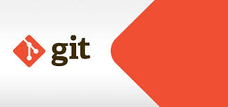

# Git va GitHub
* Text1
---
* Git
> _Git is a free and open source distributed version control system designed to handle everything from small to very large projects with speed and efficiency._

> _Git is easy to learn and has a tiny footprint with lightning fast performance. It outclasses SCM tools like Subversion, CVS, Perforce, and ClearCase with features like cheap local branching, convenient staging areas, and multiple workflows._ 

[Git lection](https://git-scm.com/)
***
* Text2
---
* GitHub
> _GitHub (/ˈɡɪthʌb/) is a developer platform that allows developers to create, store, manage and share their code. It uses Git software, which provides distributed version control of access control, bug tracking, software feature requests, task management, continuous integration, and wikis for every project.[6] Headquartered in California, it has been a subsidiary of Microsoft since 2018.[7]_

> _It is commonly used to host open source software development projects.[8] As of January 2023, GitHub reported having over 100 million developers[9] and more than 420 million repositories,[10] including at least 28 million public repositories.[11] It is the world's largest source code host as of June 2023. Over five billion developer contributions were made to more than 500 million open source projects in 2024.[12]_

[GitHub lection](https://en.wikipedia.org/wiki/GitHub)

---
* text3
---
* Readmefail
> _The readme file is the first thing a user will see when viewing your repository. It gives the user an idea of what the project is about, what language was used, what the terms and conditions are, what your project can do, shows screenshots of your running application, etc._

>__Why is it important?__
_This user could be a recruiter, your future boss or client. Therefore, it is important to note that the README of your project should answer the what, why and how of the project._
_Therefore, it is important to include the most important information, give a clear description of the project and the technology stack used, and provide links and further instructions that may not fit into the README file to avoid unnecessary searching through all the other files, which could cause the user to simply lose interest and move on to the next potential employee._

> _I cannot stress enough how important it is to write good documentation about the project. Not only is the user looking for information about the project itself, but they also see your documentation skills, your attention to detail, which could bring you that much closer to getting a job._

> _If you've read other articles of mine, you've probably noticed how important it was for my career to have learned other skills besides programming that ultimately helped me get a job. And good documentation was one of them._

> __What to put into a readme?__
_Here are some guiding questions that will help you:_

> __What is the project about?__
_Why did you develop it, what was your motivation?
What problem does it solve?
What have you learned?
What makes your project stand out?
I will show you how to convert these questions into text._

> __Possible structure__
_Description
Purpose and description of the project so that the person reading your portfolio can understand the project in the first few seconds of reading the project information._

> __Tech stack__
_Tech stack including the programming languages, libraries and frameworks your project uses (e.g.: Python, React, ...). If you have a front-end application that uses an external public API, please mention this._

> __Design__
_Examples of user interfaces associated with the project. If the project has a user interface, you can insert a GIF, video or image of the user interface._

> _If it is an application that runs on the terminal, you can create a GIF that shows how to work with it. This is good for giving an idea of how to interact with the application and what someone would see when they run the project._

> __Features__
_If your project has a lot of features, you should add a Features section and list them here._

>__How to run the project__
_Instructions on how to set up, run and use the project. This is good if someone wants to start the project from scratch, they should find everything they need to know in the project's README without needing any help from you._

 > _If it's simple, you can include it in the readme file. You can also refer to another file in your project if the instructions are longer._

 > _You should also host your project e.g. using Netlify, so users can open the deployed app and use it right away to see how it works. (Keep in mind that not every recruiter looking at your GitHub profile has a solid understanding on how to set up a project locally.)_

 [Readme Lection](https://dev.to/yuridevat/how-to-create-a-good-readmemd-file-4pa2)

 

 ___